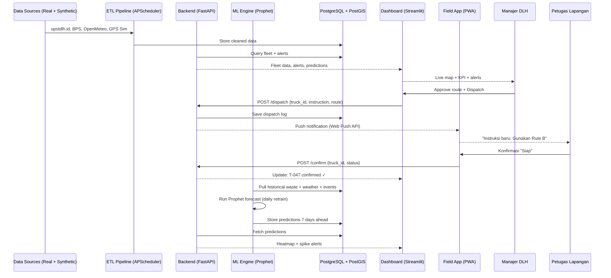
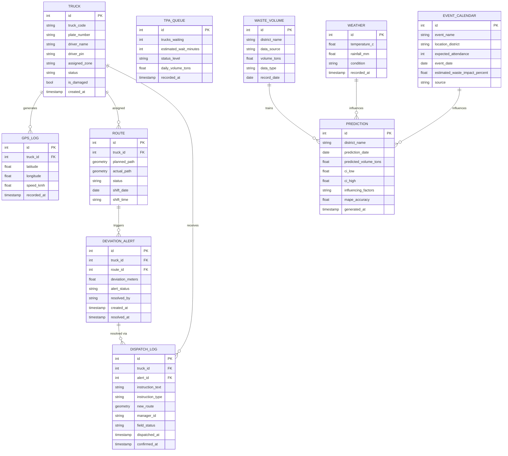

# PRD: Jakarta Waste Intelligence System (JWIS)
### AI-Powered Waste Transportation Monitoring, Field Dispatch & Volume Prediction Platform
**For:** Dinas Lingkungan Hidup (DLH) DKI Jakarta  
**Challenge:** AI Open Innovation Challenge 2026 — Case 1 & Case 2 (Integrated)  
**Version:** 2.0 | May 2026  
**Changelog v2:** Penambahan real data sources, Field Worker Dispatch Module, dan Production Architecture

---

## 1. Overview

| Section | Content |
|---------|---------|
| **Background** | Pengelolaan sampah di Jakarta masih berjalan secara reaktif: manajer DLH bergantung pada laporan manual petugas lapangan, tidak ada visibilitas real-time posisi armada truk, dan lonjakan volume sampah saat event besar atau musim hujan selalu ditangani setelah masalah terjadi. TPA Bantargebang sering mengalami antrian panjang karena jadwal tidak terkoordinasi. Ironisnya, Jakarta Smart City sebenarnya sudah memasang GPS di seluruh truk sampah sejak beberapa tahun lalu — namun sistem itu hanya bisa *melihat* tanpa bisa *bertindak*. JWIS hadir untuk mengisi gap ini: dari monitoring pasif ke **sistem aksi berbasis AI**. |
| **Primary Goal** | Membangun satu platform terintegrasi yang memungkinkan manajer DLH untuk: (1) memantau armada truk real-time, (2) mendapatkan rekomendasi rute alternatif proaktif, (3) memprediksi lonjakan volume sampah sebelum terjadi, dan (4) **mengirimkan instruksi langsung ke petugas lapangan via aplikasi mobile** — sehingga rantai komando dari data → keputusan → aksi lapangan berjalan dalam satu ekosistem. |
| **Target Users** | **Primary:** Manajer Operasional DLH — dashboard web, monitor armada, approve rute, kirim dispatch. **Secondary:** Petugas Lapangan/Sopir Truk — terima instruksi via app mobile sederhana. **Tertiary:** Eksekutif/Pimpinan — executive summary otomatis. |
| **MVP Scope** | (1) Live-tracking armada di peta Jakarta, (2) Deteksi deviasi rute & rekomendasi rute alternatif, (3) Prediksi volume sampah 3–7 hari ke depan, (4) **Field Worker Dispatch App** (notifikasi instruksi ke petugas), (5) Dashboard terpadu manajer. Prototipe kompetisi menggunakan kombinasi real public data + synthetic data untuk gap yang tidak tersedia publik. |

---

## 2. Data Sources Strategy

> Ini adalah bagian krusial yang membedakan JWIS dari prototipe biasa. Kita gunakan **data nyata sebanyak mungkin**, synthetic hanya untuk mengisi gap.

### 2.1 Data Publik yang Tersedia GRATIS (Bisa Langsung Dipakai)

| Sumber | Data | Format | URL | Refresh Rate |
|--------|------|--------|-----|--------------|
| **UPST DLH — upstdlh.id** | Volume sampah masuk TPA Bantargebang per hari (ton/hari), jumlah kendaraan masuk (rit/hari), komposisi sampah | Web scraping / dashboard publik | https://upstdlh.id/tpst/data | Harian |
| **e-Monitoring Timbangan Bantargebang** | Data timbangan truk masuk TPA real-time | Public iframe embed | http://tpstbantargebang.com/ | Real-time |
| **BPS Jakarta** | Volume sampah terangkut per hari per jenis, data historis multi-tahun | CSV / API BPS | https://jakarta.bps.go.id | Tahunan |
| **Open Data Jakarta (data.jakarta.go.id)** | Volume pengangkutan sampah di kali/sungai per kecamatan, komposisi sampah per wilayah, jumlah RT terlayani TPST | CSV download | https://data.jakarta.go.id/organization/badan-pengelolaan-lingkungan-hidup-daerah | Per update |
| **SIPSN Kemenlh** | Data timbulan sampah nasional & Jakarta, sebaran fasilitas (TPA, TPS 3R, Bank Sampah) | Web API | https://sipsn.kemenlh.go.id/sipsn/ | Tahunan |
| **OpenMeteo API** | Cuaca Jakarta real-time & forecast 7 hari (suhu, curah hujan, angin) | REST API, gratis, no key | https://open-meteo.com/en/docs | Per jam |
| **OpenStreetMap / OSRM** | Jaringan jalan Jakarta, routing, estimasi waktu tempuh | REST API, gratis | https://router.project-osrm.org/ | Real-time |
| **Waze for Cities / Google Traffic** | Data kemacetan lalu lintas Jakarta | API (free tier tersedia) | Waze CCP / Google Maps API | Real-time |

### 2.2 Data yang Perlu Synthetic (Gap Nyata)

| Data | Alasan Tidak Tersedia Publik | Strategi Synthetic |
|------|------------------------------|-------------------|
| **GPS koordinat truk DLH per 30 detik** | Sistem GPS DLH ada, tapi API tidak publik. JSC punya datanya tapi tertutup. | Generate 50 truk dengan rute realistis di 5 zona Jakarta, berdasarkan peta OSM. Tambahkan 5–10% anomali deviasi. |
| **Jadwal shift & rute resmi per truk** | Data operasional internal DLH | Buat berdasarkan zona kelurahan Jakarta (data OSM + open data wilayah) |
| **Status kerusakan armada** | Data garasi internal | Simulasi: 5% truk "breakdown" acak per hari |
| **Kalender event Jakarta detail** | Parsial tersedia di web publik | Scrape dari jakarta.go.id/agenda + tambahkan event historis (Lebaran, HUT Jakarta, CFD, dll) |

### 2.3 Data Pipeline Architecture

```
[Real Data Sources]                    [Synthetic Generator]
upstdlh.id scraper ──┐                 GPS simulator ──┐
BPS Jakarta API ─────┤                 Event calendar ─┤
OpenMeteo API ───────┼──► ETL Pipeline (Airflow/APScheduler) ──► PostgreSQL/PostGIS
Open Data Jakarta ───┤                 Route scheduler ─┘
OSRM routing ────────┘
                                              │
                                    ┌─────────┴──────────┐
                                    ▼                     ▼
                              ML Engine              Backend API
                         (Prophet + Sklearn)         (FastAPI)
                                    │                     │
                                    └─────────┬───────────┘
                                              ▼
                              ┌─── Web Dashboard (Streamlit) ←── Manager
                              └─── Mobile App (PWA) ←── Field Worker
```

---

## 3. Requirements

| Kategori | Deskripsi |
|----------|-----------|
| **Platform** | Web application (Streamlit) untuk manajer + Progressive Web App (PWA) sederhana untuk petugas lapangan via smartphone Android |
| **Users** | Dua role: **Manager** (akses penuh dashboard) dan **Field Worker** (akses terbatas: hanya terima instruksi & konfirmasi) |
| **Data Input** | Real data dari sumber publik (lihat section 2) + synthetic GPS untuk prototipe |
| **Data Specificity** | Posisi GPS truk per 30 detik, rute ditugaskan vs aktual, status armada, antrian TPA, volume sampah per kecamatan, cuaca Jakarta, event kalender |
| **Notifikasi** | Alert deviasi rute → manajer (dashboard); Instruksi perubahan rute → petugas (push notif PWA); Alert prediksi lonjakan → manajer (email + dashboard); Alert antrian TPA kritis → manajer |

---

## 4. Core Features

### 4.1 Live Fleet Tracking
- **Deskripsi:** Peta interaktif yang menampilkan posisi semua truk sampah secara real-time di atas basemap Jakarta. Setiap truk ditampilkan dengan ID, status, dan perbandingan rute ditugaskan vs aktual.
- **Acceptance Criteria:**
  - [ ] Peta memuat dalam < 3 detik dengan semua marker truk
  - [ ] Posisi truk diperbarui setiap 30 detik
  - [ ] Klik marker truk menampilkan: ID, status, rute, deviasi, driver name, last update
  - [ ] Rute aktual (biru) vs rute ditugaskan (hijau) sebagai polyline di peta
  - [ ] Filter peta per zona (Jakarta Pusat/Utara/Selatan/Timur/Barat)

### 4.2 Route Deviation Detection & Alternative Route Recommendation
- **Deskripsi:** Deteksi otomatis ketika truk menyimpang dari rute resmi. Sistem merekomendasikan rute alternatif berbasis OSRM + data kemacetan + status antrian TPA.
- **Acceptance Criteria:**
  - [ ] Deviasi > 500m dari jalur resmi memicu alert dalam < 1 menit
  - [ ] Alert ditampilkan di dashboard sebagai card merah dengan detail truk
  - [ ] Sistem menampilkan minimal 2 rute alternatif dengan estimasi waktu tempuh
  - [ ] Manajer bisa approve rute alternatif → dispatch otomatis ke petugas
  - [ ] Semua keputusan manajer tersimpan di log audit

### 4.3 TPA Bantargebang Queue Monitor
- **Deskripsi:** Panel real-time antrian truk di TPA Bantargebang menggunakan data dari e-Monitoring timbangan publik (upstdlh.id) yang sudah tersedia online.
- **Acceptance Criteria:**
  - [ ] Status antrian TPA dengan indikator visual traffic-light (hijau/kuning/merah)
  - [ ] Estimasi waktu tunggu dalam menit (berdasarkan rit/jam historis)
  - [ ] Rekomendasi penundaan keberangkatan jika antrian kritis
  - [ ] Grafik trend antrian per jam hari ini vs rata-rata historis

### 4.4 Waste Volume Prediction
- **Deskripsi:** Model prediksi ML (Prophet) yang memperkirakan volume sampah 3–7 hari ke depan per kecamatan, mengintegrasikan data historis nyata dari BPS & Open Data Jakarta + cuaca OpenMeteo + kalender event.
- **Acceptance Criteria:**
  - [ ] Prediksi tersedia untuk 7 hari ke depan minimum
  - [ ] Heatmap prediksi per kecamatan di peta Jakarta
  - [ ] Alert otomatis jika prediksi menunjukkan lonjakan ≥ 20% dari baseline
  - [ ] Breakdown faktor: "Event GBK +15%", "Curah hujan tinggi +10%", "Akhir pekan +8%"
  - [ ] MAPE model ditampilkan (akurasi backtest dari data historis nyata)

### 4.5 Field Worker Dispatch App *(Fitur Baru v2)*
- **Deskripsi:** Antarmuka mobile sederhana (PWA) untuk petugas lapangan dan sopir truk. Petugas **tidak perlu install app** — cukup buka URL di browser HP Android. Manajer bisa kirim instruksi langsung dari dashboard, dan petugas menerima notifikasi + konfirmasi.
- **Acceptance Criteria:**
  - [ ] Petugas login dengan ID truk (no password kompleks — cukup PIN 4 digit)
  - [ ] Notifikasi muncul di HP petugas ketika manajer kirim instruksi (push notif via PWA)
  - [ ] Instruksi tampil dalam format jelas: teks + peta sederhana rute baru
  - [ ] Petugas bisa konfirmasi: **"Siap"** / **"Ada kendala"** (jika ada kendala, manajer dapat alert)
  - [ ] Manajer bisa kirim pesan broadcast ke semua truk di zona tertentu (misal: "Semua truk zona Utara hindari Jl. RE Martadinata — banjir")
  - [ ] Histori instruksi tersimpan per truk per shift

### 4.6 Operational Dashboard (Command Center)
- **Deskripsi:** Halaman utama manajer DLH. Semua informasi dalam satu layar: peta fleet, KPI, alert aktif, prediksi, dan panel dispatch.
- **Acceptance Criteria:**
  - [ ] KPI cards: truk aktif, truk bermasalah, volume sampah hari ini, prediksi besok, alert belum ditangani
  - [ ] Tabel alert real-time yang bisa di-action (approve rute / dispatch petugas / dismiss)
  - [ ] Panel "Prediksi Minggu Ini" dengan highlight area berisiko lonjakan
  - [ ] Export laporan harian PDF otomatis pukul 18.00

---

## 5. User Flows

### Flow A: Manajer Merespons Deviasi Rute & Dispatch ke Petugas

```
1. Manajer buka dashboard (pukul 06.00)
   ↓
2. Alert masuk: "Truk #T-047 — deviasi 800m di Penjaringan"
   ↓
3. Manajer klik alert → lihat detail di peta
   ↓
4. Sistem tampilkan 2 rute alternatif + ETA masing-masing
   ↓
5. Manajer pilih Rute B (lebih cepat 12 menit) → klik "Approve & Dispatch"
   ↓
6. Sistem kirim push notifikasi ke HP petugas Truk #T-047
   ↓
7. Petugas terima notif: "Instruksi baru: Gunakan Rute B. [Lihat Peta]"
   ↓
8. Petugas klik "Siap" → manajer lihat konfirmasi di dashboard
   ↓
9. Status alert berubah: Resolved ✓
```

### Flow B: Manajer Respons Prediksi Lonjakan Sampah

```
1. Sistem kirim alert pukul 08.00: 
   "Prediksi lonjakan +28% di Jakarta Barat 3 hari lagi 
   (Event CFD HUT Jakarta + Curah hujan tinggi)"
   ↓
2. Manajer buka panel Prediksi → lihat heatmap + breakdown faktor
   ↓
3. Manajer putuskan: tambah 5 armada cadangan untuk Jakbar hari H
   ↓
4. Manajer klik "Broadcast ke Zona Barat": 
   "Persiapan armada tambahan untuk Sabtu. Cek kondisi kendaraan."
   ↓
5. Semua petugas zona Jakbar terima notifikasi broadcast
   ↓
6. Manajer export laporan prediksi → kirim ke pimpinan sebagai dasar keputusan anggaran
```

---

## 6. Architecture

### 6.1 MVP Architecture (Prototipe Kompetisi)



### 6.2 Komponen Sistem

| Layer | Komponen | Fungsi |
|-------|----------|--------|
| **Data Ingestion** | APScheduler + Python scrapers | Fetch data dari upstdlh.id, BPS, OpenMeteo, GPS simulator |
| **Backend** | FastAPI | REST API: fleet, alerts, routes, dispatch, predictions |
| **ML Engine** | Prophet + Scikit-Learn | Prediksi volume sampah; deteksi anomali deviasi rute |
| **Routing** | OSRM (open-source) | Kalkulasi rute alternatif & ETA |
| **Database** | PostgreSQL + PostGIS | Semua data: GPS, rute, prediksi, dispatch log |
| **Manager UI** | Streamlit + Folium + Plotly | Dashboard web interaktif untuk manajer |
| **Field Worker UI** | Progressive Web App (PWA) | App mobile ringan, no install, push notif via browser |
| **Push Notif** | Web Push API (VAPID) | Kirim notifikasi ke HP petugas tanpa app store |
| **Scheduler** | APScheduler | Update GPS 30s, retrain ML harian, auto-report 18.00 |

---

## 7. Database Schema



| Tabel | Deskripsi |
|-------|-----------|
| `truck` | Master armada + data driver (PIN login untuk PWA) |
| `route` | Rute ditugaskan vs aktual per shift |
| `gps_log` | Log posisi GPS per 30 detik |
| `deviation_alert` | Alert deviasi yang terdeteksi AI |
| `dispatch_log` | **Baru:** Log semua instruksi manajer → petugas + konfirmasi |
| `tpa_queue` | Snapshot antrian TPA dari data real upstdlh.id |
| `waste_volume` | Data historis volume sampah (real: BPS + Open Data Jakarta) |
| `weather` | Data cuaca real dari OpenMeteo API |
| `event_calendar` | Kalender event Jakarta (real scraping + synthetic) |
| `prediction` | Output forecast model Prophet per kecamatan |

---

## 8. Tech Stack

### 8.1 MVP Stack (Prototipe Kompetisi — Biaya Rp 0)

| Layer | Teknologi | Alasan |
|-------|-----------|--------|
| **Language** | Python 3.11 | Standar AI/ML, semua library gratis |
| **Backend** | FastAPI | Modern, async, auto-docs Swagger |
| **Manager Dashboard** | Streamlit | Dashboard profesional pure Python |
| **Field Worker App** | Progressive Web App (PWA) | No install; push notif via browser; works di Android low-end |
| **Push Notification** | Web Push API (VAPID, pywebpush) | Gratis, no third-party service |
| **Peta** | Folium + Leaflet.js | OpenStreetMap, gratis |
| **ML Prediksi** | Facebook Prophet | Time-series dengan seasonality, gratis |
| **ML Anomali** | Scikit-Learn (IsolationForest) | Deteksi deviasi rute tanpa labeled data |
| **Routing** | OSRM | Open-source routing berbasis OSM |
| **Database** | PostgreSQL + PostGIS | Gratis, geo-spatial queries |
| **Visualisasi** | Plotly | Grafik interaktif |
| **Scheduler** | APScheduler | Background tasks dalam satu proses |
| **Data Scraping** | BeautifulSoup + Requests | Scrape upstdlh.id & portal publik |
| **Dev Environment** | Google Colab + GitHub | GPU gratis untuk training, version control |

### 8.2 Production Stack (Untuk Presentasi Juri — Roadmap Skala Penuh)

> Ini menunjukkan visi jangka panjang jika JWIS diimplementasikan secara resmi oleh DLH.

```
┌──────────────────────────────────────────────────────────────────────┐
│                        PRODUCTION ARCHITECTURE                        │
│                                                                        │
│  [IoT Layer]                                                           │
│  GPS Device (tiap truk) ──► MQTT Broker (Mosquitto) ──► Kafka         │
│                                                      (real-time stream) │
│                                           │                            │
│  [Data Platform]                          ▼                            │
│  Apache Kafka ──► Apache Spark (stream processing)                     │
│                       │                                                │
│                       ▼                                                │
│  Data Lake (MinIO/S3) ◄──► Apache Airflow (ETL orchestration)         │
│                       │                                                │
│                       ▼                                                │
│  [Storage]                                                             │
│  PostgreSQL + PostGIS (operational DB)                                 │
│  ClickHouse (analytics/historical queries)                             │
│  Redis (caching: live positions, alert state)                          │
│                       │                                                │
│  [ML Platform]        ▼                                                │
│  MLflow (experiment tracking) ──► Prophet + LightGBM (prediction)     │
│  Seldon Core (model serving via Kubernetes)                            │
│                       │                                                │
│  [Application Layer]  ▼                                                │
│  FastAPI ──► React (Manager Dashboard, enterprise UI)                  │
│  FastAPI ──► React Native (Field Worker App, offline-capable)          │
│  FastAPI ──► Firebase Cloud Messaging (push notif)                     │
│                       │                                                │
│  [Infrastructure]     ▼                                                │
│  Kubernetes (GKE/EKS) ──► Horizontal Auto-scaling                     │
│  NGINX (load balancer) ──► Cloudflare (CDN + DDoS protection)         │
│  Prometheus + Grafana (system monitoring)                              │
│  CI/CD: GitHub Actions ──► ArgoCD                                     │
│                                                                        │
│  [Integration]                                                         │
│  Jakarta Smart City API (existing GPS if opened)                       │
│  JAKI App integration (citizen reporting)                              │
│  Waze for Cities API (real-time traffic)                               │
│  BMKG API (official weather Indonesia)                                 │
└──────────────────────────────────────────────────────────────────────┘
```

**Perbandingan MVP vs Production:**

| Aspek | MVP (Kompetisi) | Production |
|-------|----------------|------------|
| GPS Data | Synthetic simulator | GPS hardware di tiap truk → MQTT → Kafka |
| Streaming | APScheduler (30s poll) | Apache Kafka (< 1s real-time) |
| Frontend Manager | Streamlit | React (enterprise UI) |
| Frontend Petugas | PWA sederhana | React Native (offline-capable) |
| Push Notif | Web Push API | Firebase Cloud Messaging |
| ML Serving | Inline dalam FastAPI | Seldon Core di Kubernetes |
| Database | Single PostgreSQL | PostgreSQL + ClickHouse + Redis |
| Deployment | Localhost laptop | Kubernetes cluster (GKE) |
| Skalabilitas | 1 user, 50 truk | 1000+ user, 2000+ truk seluruh Jakarta |

---

## 9. Field Worker App Specification *(Baru v2)*

### Desain Prinsip
- **Zero friction:** Petugas tidak perlu download app. Buka URL di browser Chrome Android.
- **Offline-ready:** Instruksi terakhir tersimpan di cache (Service Worker) — bisa dibaca meski sinyal jelek.
- **Aksi minimal:** Petugas hanya butuh 2 tombol: **"Siap ✓"** dan **"Ada Kendala ⚠"**
- **Bahasa sederhana:** Semua teks dalam Bahasa Indonesia informal yang mudah dipahami

### Wireframe Konsep

```
┌─────────────────────────────────┐
│  🚛 JWIS — Truk #T-047          │
│  Sopir: Pak Budi | Zona: Utara  │
├─────────────────────────────────┤
│  📍 STATUS SHIFT HARI INI       │
│  Rute: Penjaringan → Bantargebang│
│  Estimasi selesai: 14.30        │
├─────────────────────────────────┤
│  🔴 INSTRUKSI BARU — 09.15      │
│  ──────────────────────────     │
│  "Ganti ke Rute B. Jl. Pluit   │
│  macet parah. Lewat Jl. Muara  │
│  Baru → Jl. Bahari."           │
│                                 │
│  [🗺 Lihat di Peta]             │
│                                 │
│  [ ✅ Siap ]  [ ⚠ Ada Kendala ] │
├─────────────────────────────────┤
│  📋 INSTRUKSI SEBELUMNYA        │
│  08.10 — Rute Normal ✓          │
│  07.45 — Mulai shift ✓          │
└─────────────────────────────────┘
```

### Tech Stack PWA

| Komponen | Teknologi | Keterangan |
|----------|-----------|------------|
| Framework | Vanilla JS + Service Worker | Ringan, no framework besar |
| Push Notif | Web Push API (VAPID) | Notif muncul meski browser tutup |
| Offline | Service Worker Cache | Instruksi terakhir tersimpan lokal |
| Peta petugas | Leaflet.js (lightweight) | Tampilkan rute baru sederhana |
| Auth | PIN 4 digit + truck_code | Cukup untuk prototipe |

---

## 10. Design & Technical Constraints

### Technical Constraints
- GPS real-time dari DLH tidak tersedia secara publik → gunakan synthetic untuk prototipe. Arsitektur sudah disiapkan untuk *plug-in* data nyata begitu akses tersedia.
- OSRM public demo server memiliki rate limit → untuk demo live, pre-compute & cache rute populer.
- Web Push membutuhkan HTTPS → untuk demo: gunakan ngrok untuk tunnel localhost ke HTTPS gratis.
- Streamlit tidak mendukung push notif → dashboard manajer pakai polling (auto-refresh 30s); PWA untuk petugas yang butuh notif.

### UI/UX Guidelines

| Aspek | Spesifikasi |
|-------|-------------|
| **Tema warna** | Hijau DLH: Primary `#2D6A4F`, Accent `#74C69D`, Warning `#F4A261`, Danger `#E76F51` |
| **Dashboard** | Sidebar navigasi + main content; KPI cards selalu visible |
| **Alert colors** | Traffic light: Merah kritis, Kuning peringatan, Hijau normal |
| **PWA Petugas** | Full-screen mobile-first, font besar (16px+), tombol besar mudah diklik |
| **Bahasa** | Bahasa Indonesia formal di dashboard manajer; informal & singkat di PWA petugas |

---

## 11. Success Metrics

| Metrik | Target MVP | Target Production |
|--------|-----------|-------------------|
| Akurasi deteksi deviasi rute | ≥ 90% true positive | ≥ 95% |
| Akurasi prediksi volume (MAPE) | ≤ 15% | ≤ 10% |
| Waktu load dashboard | < 3 detik | < 1 detik |
| Waktu pengiriman dispatch → notif petugas | < 5 detik | < 2 detik |
| Waktu respons konfirmasi petugas | Dimonitor (baseline) | Target ≤ 3 menit |
| Coverage data nyata vs synthetic | ≥ 40% real data | ≥ 95% real data |

---

## 12. Risks & Mitigations

| Risiko | Probabilitas | Dampak | Mitigasi |
|--------|-------------|--------|----------|
| **Data publik berubah format** (web scraping upstdlh.id) | Sedang | Sedang | Buat scraper robust + fallback ke CSV manual jika gagal |
| **OSRM rate limit saat demo** | Sedang | Tinggi | Pre-cache rute utama Jakarta; siapkan fallback ke straight-line ETA |
| **Push notif PWA tidak jalan di iOS** | Tinggi | Sedang | iOS baru mendukung Web Push sejak iOS 16.4 — batasi demo ke Android; di production gunakan React Native |
| **Streamlit terlalu lambat untuk real-time** | Rendah | Sedang | Gunakan `st.empty()` + threading; siapkan demo video sebagai backup |
| **Juri tanya: bagaimana mendapatkan GPS data DLH yang nyata?** | Tinggi | Rendah | Jawaban: Jakarta Smart City sudah pasang GPS di semua truk. JWIS siap integrasi begitu DLH membuka API-nya — arsitektur Kafka sudah disiapkan untuk ini |

---

## 13. Development Roadmap

| Fase | Durasi | Output | Prioritas |
|------|--------|--------|-----------|
| **Fase 1: Data Pipeline** | 2–3 hari | Scraper upstdlh.id, BPS downloader, OpenMeteo integration, GPS simulator, ETL ke PostgreSQL | 🔴 Kritis |
| **Fase 2: ML Engine** | 2–3 hari | Prophet model terlatih (data nyata + synthetic), IsolationForest untuk anomali rute, backtest & MAPE calculation | 🔴 Kritis |
| **Fase 3: Backend API** | 2 hari | FastAPI endpoints: fleet, alerts, routes, dispatch, predictions, reports | 🔴 Kritis |
| **Fase 4: Manager Dashboard** | 2–3 hari | Streamlit dashboard: live map, KPI, alert panel, prediction heatmap, dispatch panel | 🔴 Kritis |
| **Fase 5: Field Worker PWA** | 1–2 hari | PWA sederhana: login PIN, tampil instruksi, konfirmasi, push notif via ngrok HTTPS | 🟡 Penting |
| **Fase 6: Integration & Polish** | 1–2 hari | Koneksi semua komponen, polish UI, testing demo flow end-to-end | 🟡 Penting |
| **Fase 7: Presentasi** | 1 hari | Executive summary PDF, slide deck, dry run demo, siapkan jawaban untuk pertanyaan juri | 🟡 Penting |

**Total estimasi: 11–16 hari kerja**

---

## Appendix A: Real Data Quick Start

```python
# 1. Data volume sampah TPA Bantargebang — scrape dari upstdlh.id
import requests
from bs4 import BeautifulSoup

url = "https://upstdlh.id/tpst/data"
response = requests.get(url)
soup = BeautifulSoup(response.content, 'html.parser')
# Parse trend chart data...

# 2. Cuaca Jakarta real-time — OpenMeteo (GRATIS, no API key)
import openmeteo_requests

om = openmeteo_requests.Client()
params = {
    "latitude": -6.2088,
    "longitude": 106.8456,
    "daily": ["precipitation_sum", "temperature_2m_max"],
    "forecast_days": 7,
    "timezone": "Asia/Jakarta"
}
responses = om.weather_api("https://api.open-meteo.com/v1/forecast", params=params)

# 3. Routing alternatif — OSRM (GRATIS)
import requests

def get_route(origin_lat, origin_lon, dest_lat, dest_lon):
    url = f"http://router.project-osrm.org/route/v1/driving/{origin_lon},{origin_lat};{dest_lon},{dest_lat}"
    params = {"overview": "full", "geometries": "geojson", "alternatives": "true"}
    response = requests.get(url, params=params)
    return response.json()  # Includes 2 alternative routes + ETA each

# 4. Data historis BPS Jakarta
# Download CSV dari: https://jakarta.bps.go.id/en/statistics-table/2/OTE2IzI=/
# volume-sampah-yang-terangkut-per-hari-menurut-jenis-sampah-di-provinsi-dki-jakarta.html
```

---

*PRD Version 2.0 | AI Open Innovation Challenge 2026 | Jakarta Waste Intelligence System (JWIS)*  
*Updated: May 2026 — Added: Real Data Sources, Field Worker Dispatch App, Production Architecture*
